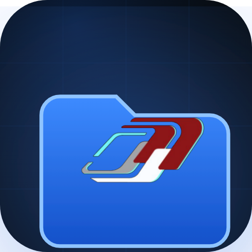
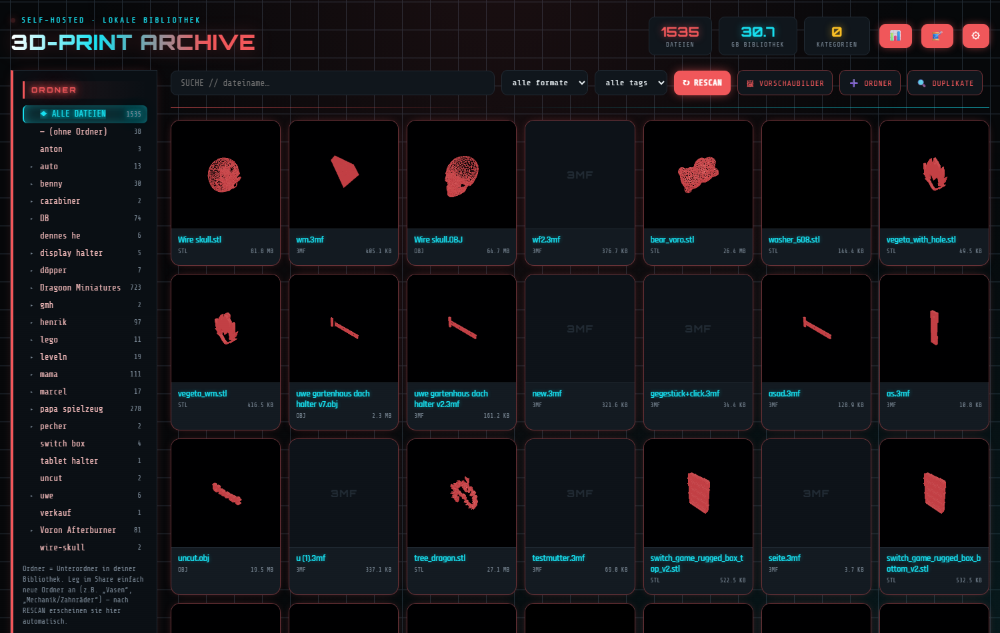
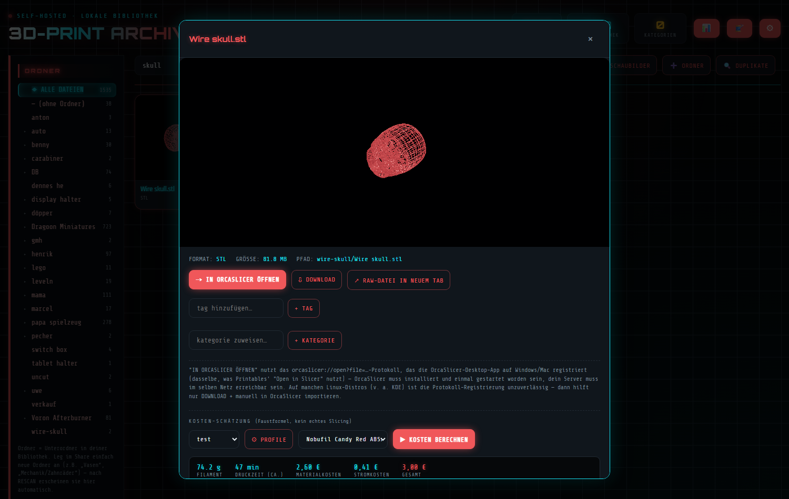
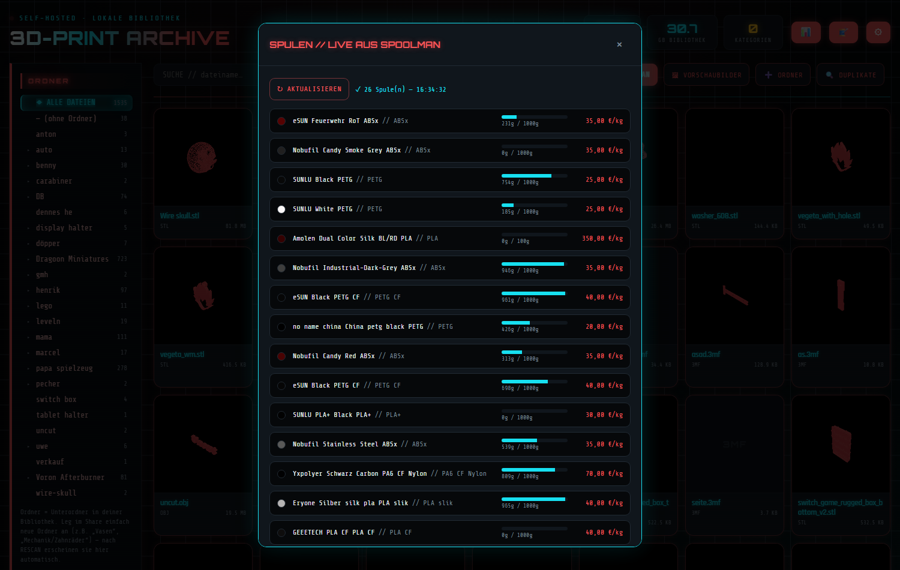
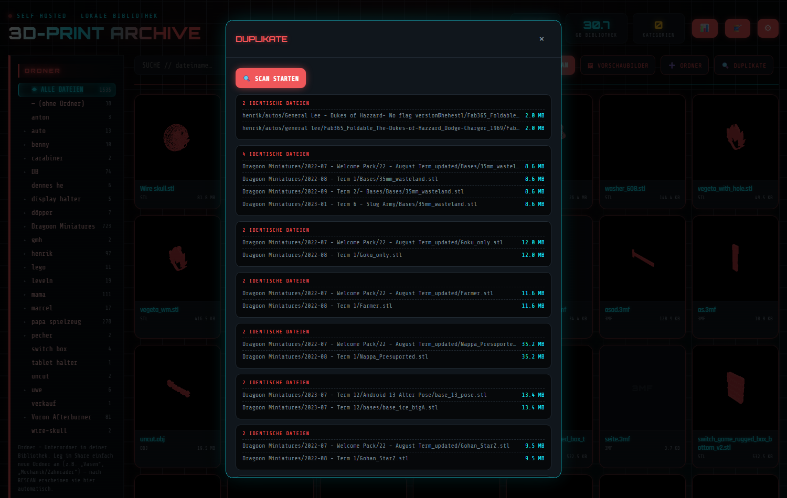

# PrintArchive

Selbstgehostete STL/3MF/OBJ-Bibliothek mit eigenem Cyberpunk-UI. Backend: Node.js/Express +
SQLite. Frontend: Vanilla JS + Three.js (3D-Vorschau direkt im Browser, Neon-Glow-Rendering).
Läuft als Docker-Container (z. B. auf Unraid) oder als eigenständiger Windows-Installer — kein
Cloud-Kram, alles bleibt lokal.



## Features

- **Bibliothek durchsuchen** — rekursiver Scan nach `.stl`, `.3mf`, `.obj`, Ordnerstruktur +
  frei anlegbare Kategorien (unabhängig vom Dateisystem) + Tags, Volltextsuche, Filter nach
  Format/Tag/Kategorie
- **Mehrere Bibliotheks-Ordner** — beliebig viele zusätzliche Ordner zur Laufzeit hinzufügen,
  nicht nur ein fest gemounteter Pfad
- **3D-Viewer im Browser** — STL/OBJ/3MF frei drehen/zoomen, Neon-Rot-Rendering mit
  Bloom-Glow-Postprocessing, automatisch erzeugte Vorschaubilder (auch als Hintergrund-Batch für
  die ganze Bibliothek)
- **"An Slicer öffnen"** — direkte Übergabe an OrcaSlicer per `orcaslicer://`-Protokoll
- **Kosten-Schätzung vor dem Druck** — Filamentgewicht + Druckzeit-Richtwert aus
  Modellgeometrie (Volumen/Oberfläche) + eigenen Druckprofilen (Schichthöhe, Fülldichte, Düse,
  Geschwindigkeit, Drucker-Watt); mehrere Profile möglich. Faustformel, kein echtes Slicing.
- **Echte Druck-Kosten-Verfolgung** — Start/Stop-Timer pro Druck, Stromkosten kommen live über
  einen Home-Assistant-Energiesensor für exakt das Zeitfenster, Filamentkosten über Spoolman
- **Spoolman-Anbindung** — Live-Spulenübersicht (Restgewicht, Preis/kg, Material, Farbe), beim
  Druck direkt auswählbar, Verbrauch wird automatisch zurückgebucht
- **Statistik-Dashboard** — Gesamtkosten, Filamentverbrauch, Top-Kategorien/-Dateien über alle
  getrackten Drucke
- **Duplikat-Erkennung** — SHA-256-Inhalts-Hash statt nur Dateiname/-größe, reine Anzeige,
  löscht nichts automatisch
- Rührt die Originaldateien nicht an — reiner Lesezugriff

Home Assistant und Spoolman sind komplett optional — ohne die läuft Bibliothek/Viewer/
Kosten-Schätzung trotzdem, nur ohne Live-Daten bzw. mit manueller Preis-Eingabe.

**Kein** Moonraker/Klipper-Uplink, kein automatisches G-Code-Generieren.

## Screenshots

| 3D-Viewer + Kosten-Schätzung | Spoolman live | Duplikat-Erkennung |
|---|---|---|
|  |  |  |

## Installation — Windows

> **Windows SmartScreen wird warnen** ("Der Computer wurde durch Windows geschützt") — das ist
> normal für unsignierte Open-Source-Software, eine Signatur kostet ein kostenpflichtiges
> Code-Signing-Zertifikat. Auf **"Weitere Informationen"** und dann **"Trotzdem ausführen"**
> klicken. Wer's nicht glauben will: Quellcode liegt komplett in diesem Repo.

1. Neuestes `PrintArchive-Setup.exe` von den [Releases](../../releases) laden und starten
2. Assistent durchklicken:
   - **Bibliotheksordner** wählen (Standard: `Dokumente\PrintArchive\Bibliothek`) — wird beim
     ersten Start automatisch angelegt, falls er noch nicht existiert
   - optional Spoolman (IP + Port, Standard 7912) und Home Assistant (IP + Port, Standard 8123)
     einrichten
   - Desktop-Verknüpfung / Autostart nach Wunsch
3. Fertig — Browser öffnet automatisch `http://localhost:8420`. Läuft danach ohne sichtbares
   Konsolenfenster im Hintergrund; zum Beenden die Verknüpfung **"PrintArchive beenden"** im
   Startmenü-Ordner nutzen.
4. Datenbank liegt unter `%APPDATA%\PrintArchive`. Weitere Ordner (beliebiger Pfad) über
   **➕ ORDNER** in der App hinzufügen.

Kein separates Node.js-Setup nötig (gebündelt). Sauberer Deinstaller über "Programme" bzw.
Startmenü — Bibliothek/Datenbank bleiben dabei erhalten.

## Installation — Docker / Unraid

```bash
git clone https://github.com/GmhF3NiX/klipper-mcu-updater.git
cd klipper-mcu-updater/printarchive
# docker-compose.yml: Volume-Pfad auf deinen echten Modelle-Share anpassen
docker compose up -d --build
# -> http://<server-ip>:8420
```

In Unraid alternativ über **Docker → Add Container** (Repository `printarchive`, Port
8420→8420, Volume-Mapping wie in `docker-compose.yml`).

### Unraid — fertiges Template (statt selbst bauen)

Es gibt ein fertiges Community-Applications-Template, das direkt das gebaute Image von
[GitHub Container Registry](https://github.com/GmhF3NiX/klipper-mcu-updater/pkgs/container/printarchive)
zieht (`ghcr.io/gmhf3nix/printarchive`), kein `docker compose up --build` nötig:

1. Unraid → **Docker**-Tab → **Add Container** → ganz unten **Template repositories**
2. URL einfügen: `https://raw.githubusercontent.com/GmhF3NiX/klipper-mcu-updater/main/printarchive/unraid-template/printarchive.xml`
3. Speichern, dann oben bei **Select a template** "PrintArchive" auswählen
4. Pfade (Bibliothek/Konfiguration) auf deine echten Shares anpassen, Apply

*(Noch nicht im durchsuchbaren Community-Applications-Store gelistet — dafür bräuchte es eine
Forum-Registrierung + Prüfung durch das CA-Team. Der Weg oben funktioniert schon jetzt genauso
gut, nur ohne Suchfunktion in der Apps-Übersicht.)*

### Env-Variablen (Docker)

| Variable | Default | Bedeutung |
|---|---|---|
| `LIBRARY_PATH` | `/library` | primärer gemounteter Ordner mit deinen Modellen |
| `CONFIG_DIR` | `/config` | Ablage für SQLite-DB + Thumbnail-Cache |
| `PORT` | `8420` | interner Port |
| `PUID` / `PGID` | `99` / `100` | Nutzer, unter dem der Prozess läuft (Unraid-Standard) |
| `RESCAN_INTERVAL_MINUTES` | `15` | automatischer Re-Scan der Bibliothek |
| `HOSTSHARES_PATH` | `/hostshares` | read-only-Mount, unter dem sich per UI weitere Ordner hinzufügen lassen |

Strompreis, Home-Assistant-Zugang und Spoolman-URL werden **nicht** über Env-Variablen gesetzt,
sondern über das ⚙-Einstellungen-Menü in der App selbst (landen in der SQLite-DB).

## Lokal ohne Docker testen

```bash
npm install
LIBRARY_PATH=/pfad/zu/deinen/modellen CONFIG_DIR=./config npm start
# -> http://localhost:8420
```

Unter Windows läuft die App auch nativ (ohne Docker) — dann greifen automatisch
Windows-taugliche Standardpfade (`Dokumente\PrintArchive`, `%APPDATA%\PrintArchive`) statt
`/library`/`/config`, siehe `windows-installer/README.md` zum Selbstbauen des Installers.

## Grenzen, die du kennen solltest

- **Druckzeit-Schätzung ist eine Faustformel** (Modellvolumen/-oberfläche + Druckprofil), kein
  echtes Slicing. Filamentgewicht ist brauchbar genau, die Zeit ein grober Richtwert.
- **3MF-Kompatibilität**: Three.js' `3MFLoader` deckt gängige Slicer-Exporte ab, aber nicht jede
  Variante (z. B. exotische CAD-Exporte). Fällt der Live-Viewer aus, funktioniert Download/
  Öffnen trotzdem.
- **Kein automatischer Druckerversand**: "An Slicer öffnen" nutzt Protokoll-Handoff an die
  Slicer-Desktop-App, keine direkte Prozesskopplung.
- **Kein Multi-User/Login**: gedacht für den Betrieb im eigenen Netz. Für Fernzugriff hinter
  Reverse-Proxy mit eigener Authentifizierung betreiben.
